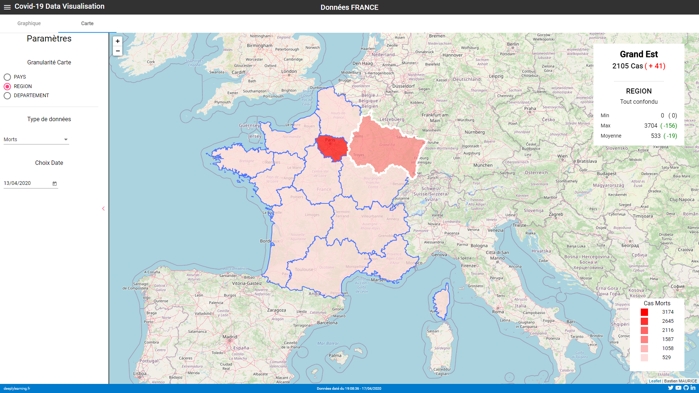
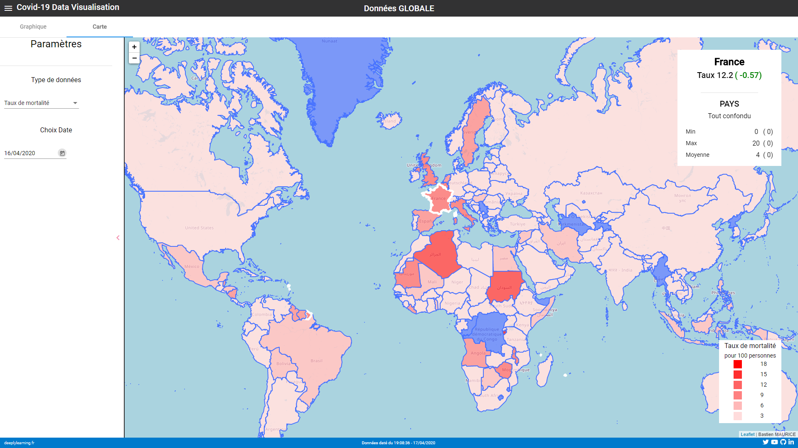

# Leaflet.js dans une application Angular 9
## Description
Article complet sur l'intégration disponible sur mon blog :

**https://deeplylearning.fr/cours-pratiques-data-visualization/integration-de-leaflet-dans-angular-9-carte-choroplethe/**

## Capture d'écran

## Lancement
1. `$ git clone`
2. `$ npm run start`
3. Lancer un navigateur internet sur localhost:4200